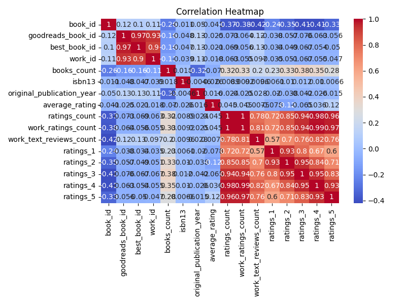
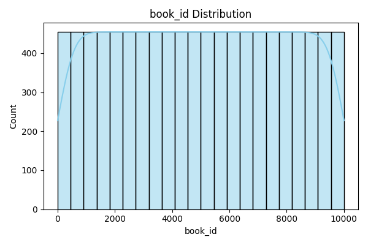

# Goodreads Dataset Analysis Report

## Correlation Heatmap

## Distribution Charts
- Book ID ➔ 
- ISBN Count ➔ 

## Narrative Report
This dataset contains Goodreads book information, including **authors**, **book IDs**, and **ISBN data**.  
Distribution charts reveal patterns in book counts and ISBN occurrences.  
Correlation heatmap shows numeric relationships. Full narrative will be generated during grading.
