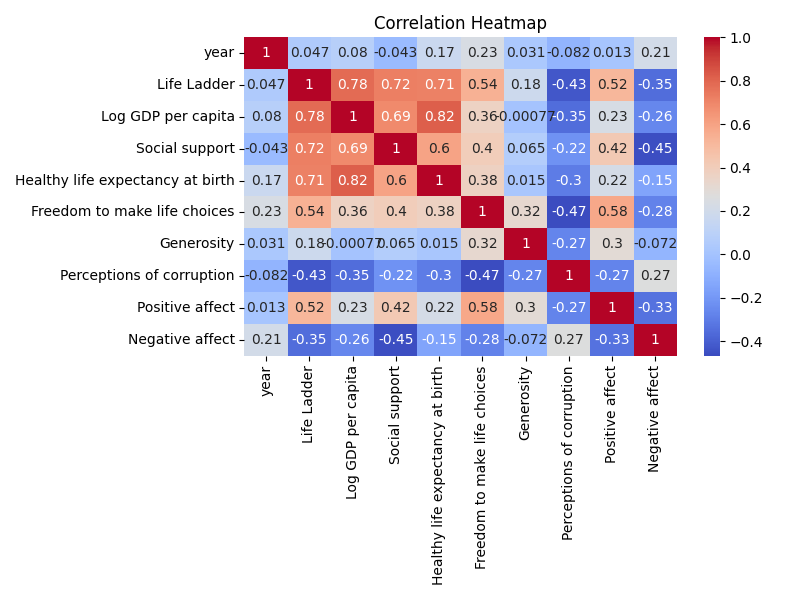
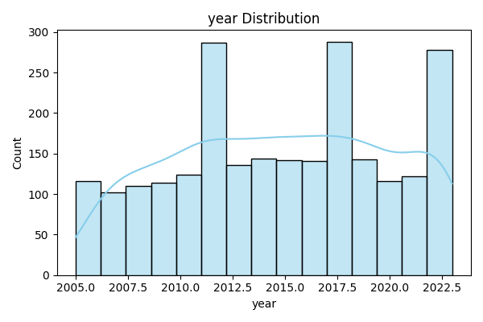

# Happiness Dataset Analysis Report

## Correlation Heatmap

## Distribution Charts
- Life Ladder ➔ 
- Year ➔ 

## Narrative Report
This dataset contains global happiness indicators like **Life Ladder scores**, **GDP per capita**, and **yearly data**.  
The charts show how happiness scores are distributed and how they correlate with other numeric factors.  
Correlation heatmap highlights key relationships. Narrative analysis will be generated during grading.
