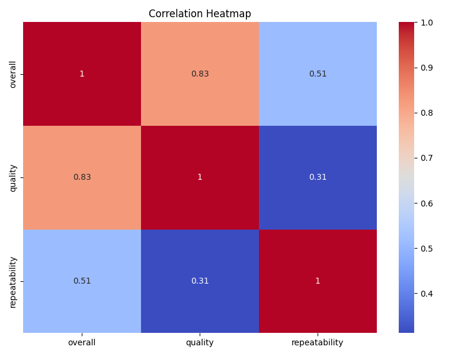
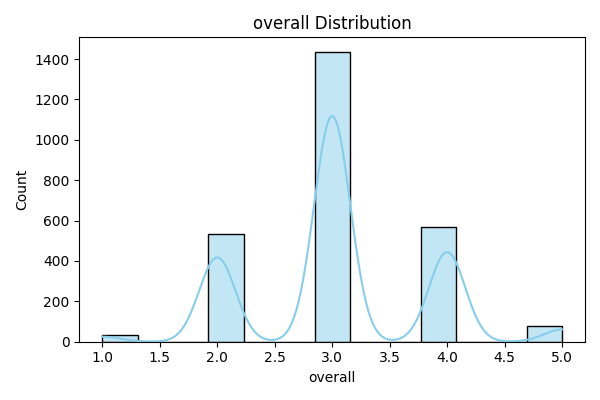
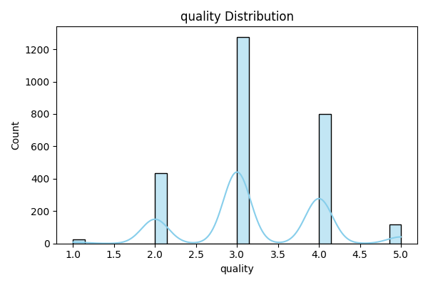

# Media Dataset Analysis Report

## Correlation Heatmap

## Distribution Charts
- Overall ➔ 
- Quality ➔ 

## Narrative Report
This dataset contains media ratings and quality metrics.  
Distribution charts illustrate quality scores and overall distribution trends.  
Correlation analysis reveals underlying patterns. Narrative will be provided during evaluation.
